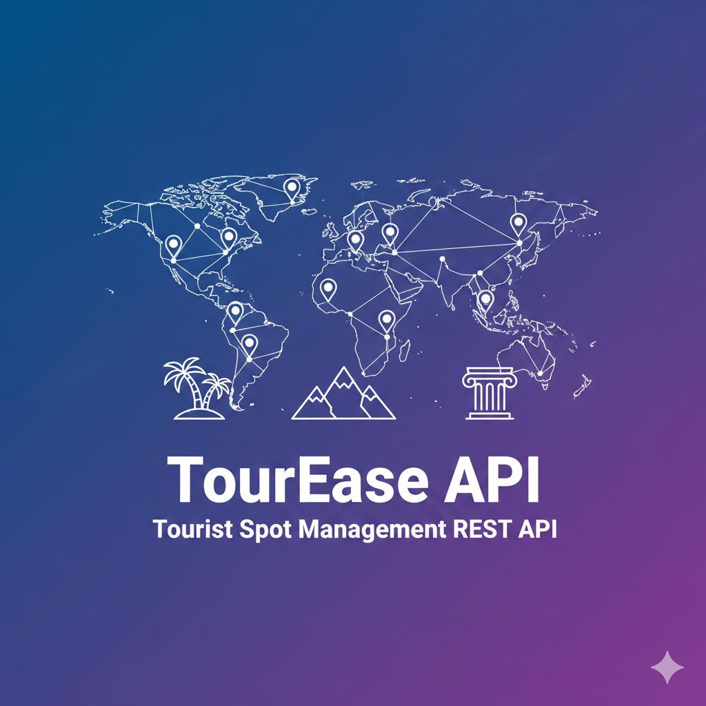

# 🌍 TourEase API


---

## 📌 Overview

**TourEase API** is a Spring Boot–based RESTful web service designed to manage tourist spot information efficiently.  
It provides full CRUD operations along with advanced filtering features such as search by city, type, and minimum rating.

This project demonstrates **real-world backend development practices** including layered architecture, DTO usage, exception handling, and database persistence.

---
## 🚀 Project Preview

<p align="center">
  
</p>

> *Your Spring Boot–powered Tourist Spot Management REST API*


---

## ✨ Features

- ✅ Create, Read, Update, Delete (CRUD) tourist spots
- 🔍 Search tourist spots by **city**
- 🏷️ Filter tourist spots by **type**
- ⭐ Filter by **minimum rating**
- 🛑 Global exception handling with clean JSON responses
- 🧩 DTO-based API design (no entity exposure)
- 🕒 Auto-managed timestamps & optimistic locking

---

## 🛠️ Tech Stack

| Layer | Technology |
|-----|-----------|
| Language | Java 21 |
| Framework | Spring Boot |
| Web | Spring Web MVC |
| Persistence | Spring Data JPA + Hibernate |
| Database | PostgreSQL |
| Build Tool | Maven |
| Utilities | Lombok |

---

## 🏗️ Architecture Overview

Controller Layer → Service Layer → Repository Layer → Database
↓ ↓ ↓
DTOs Business Logic JPA/Hibernate


✔️ Clean separation of concerns  
✔️ Scalable & maintainable design  

---

## 🚀 Getting Started

### 🔹 1. Clone the Repository
```bash
git clone https://github.com/Nicode2707/TourEase-API.git
cd TourEase-API

2. Database Configuration (PostgreSQL)

Create a PostgreSQL database:

CREATE DATABASE tourease_db;


Update src/main/resources/application.properties:

spring.datasource.url=jdbc:postgresql://localhost:5432/tourease_db
spring.datasource.username=your_postgres_username
spring.datasource.password=your_postgres_password

spring.jpa.hibernate.ddl-auto=update
spring.jpa.show-sql=true
spring.jpa.properties.hibernate.dialect=org.hibernate.dialect.PostgreSQLDialect


📌 Tables will be auto-created on application startup.


3.Run the Application

Windows

mvnw.cmd spring-boot:run


Linux / macOS

./mvnw spring-boot:run


📍 API Base URL:

http://localhost:8080/api

🔗 API Endpoints

| Method | Endpoint                         | Description               |
| ------ | -------------------------------- | ------------------------- |
| POST   | `/tourist-spot/add-spot`         | Create a new tourist spot |
| GET    | `/tourist-spot/get-spot/{id}`    | Get tourist spot by ID    |
| GET    | `/tourist-spot/get-all-spots`    | Get all tourist spots     |
| PUT    | `/tourist-spot/update-spot/{id}` | Update a tourist spot     |
| DELETE | `/tourist-spot/delete-spot/{id}` | Delete a tourist spot     |
| GET    | `/tourist-spot/city/{city}`      | Find spots by city        |
| GET    | `/tourist-spot/type/{type}`      | Find spots by type        |
| GET    | `/tourist-spot/rating?min={min}` | Filter by minimum rating  |


📥 Sample Request Body
{
  "name": "Eiffel Tower",
  "city": "Paris",
  "type": "Monument",
  "rating": 4.8
}


👨‍💻 Author

Niraj Kumar
🎓 JIS College of Engineering
💻 Java Developer
🔗 GitHub: https://github.com/Nicode2707
